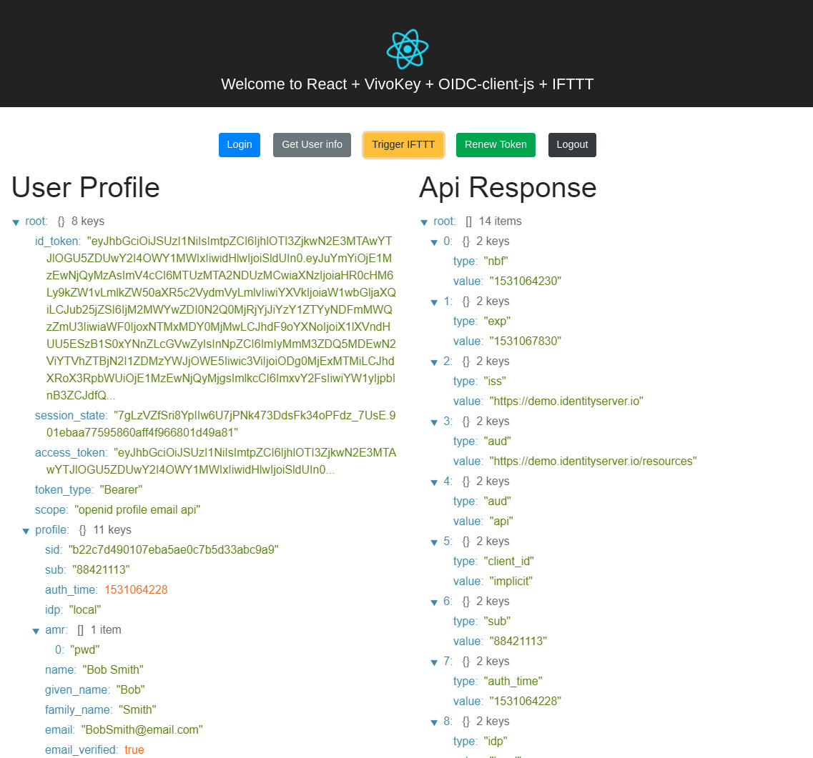

# React-oidc-client-js

> OpenID Connect (OIDC) client with React and typescript 

- This is sample application that contains [oidc-client-js](https://github.com/IdentityModel/oidc-client-js) and `React` with `Typescript`. It is configured to talk to Vivokey API and IFTTT via Webhooks.

- The application is based on `create-react-app` - [Create React App](https://github.com/facebook/create-react-app)

# Installation

## Cloning app

- `git clone https://github.com/Omodaka9375/React-oidc-client-js.git`

## Install dependecies

- Install dependecies - `npm install`

## Running app

Before running the server go to 'src/helpers/Constants.ts':
- Fill in your IFTTT secret key and event name to pass to webhook
- For values go to 'src/components/AppContent.tsx' line 49 and add number of parametars you want passed (optional).
- Fill in Vivokey client ID and client secret.

- `yarn start` - start the web server that is running on [http://localhost:4200](http://localhost:4200)

- The application is connected to `OpenID Connect Provider` that is running on [https://api.vivokey.com/openid/](https://api.vivokey.com/openid/)
- This STS has configured a SPA client to run on http://localhost:4200, therefore a sample application will be running on this port `4200`.

## App preview

